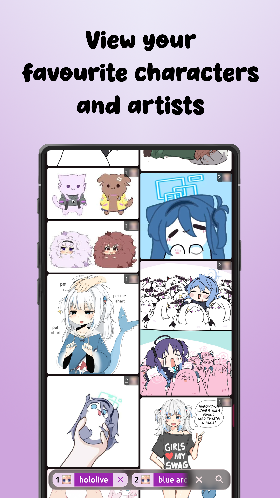
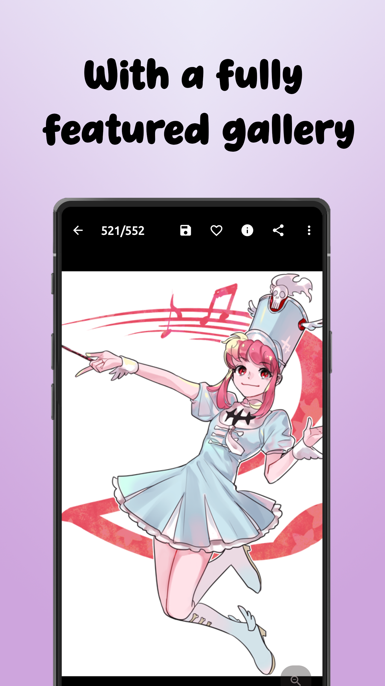
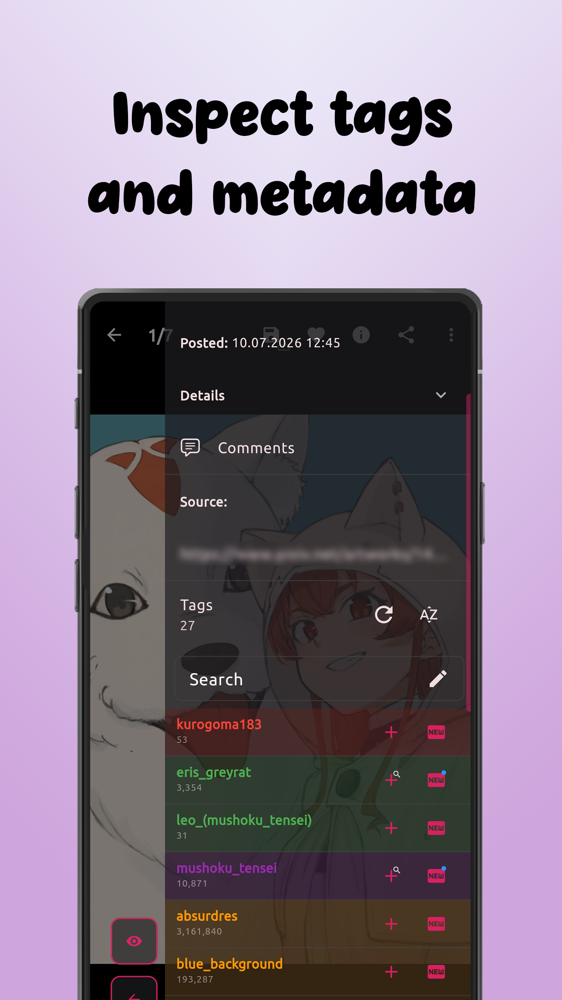
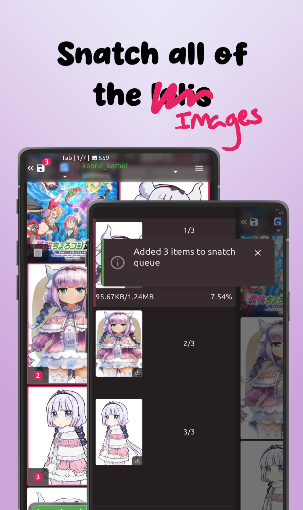
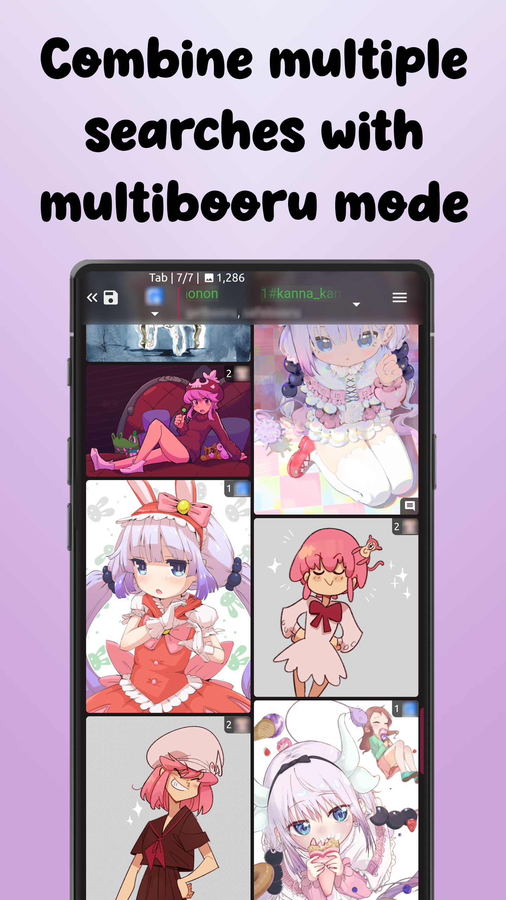
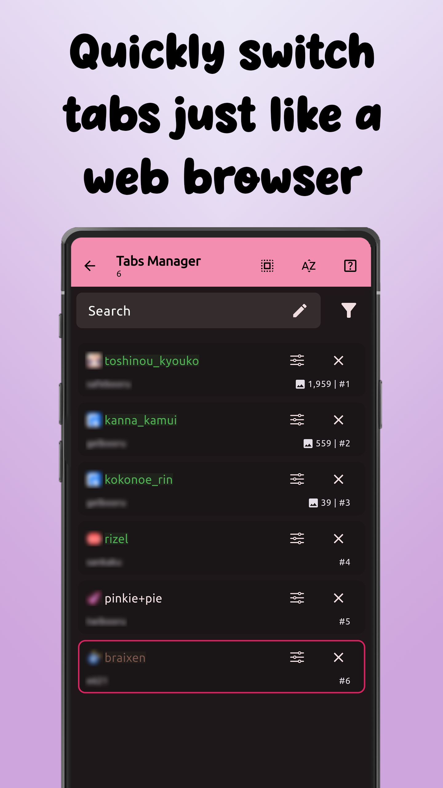
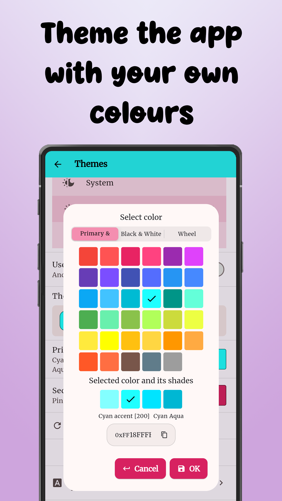
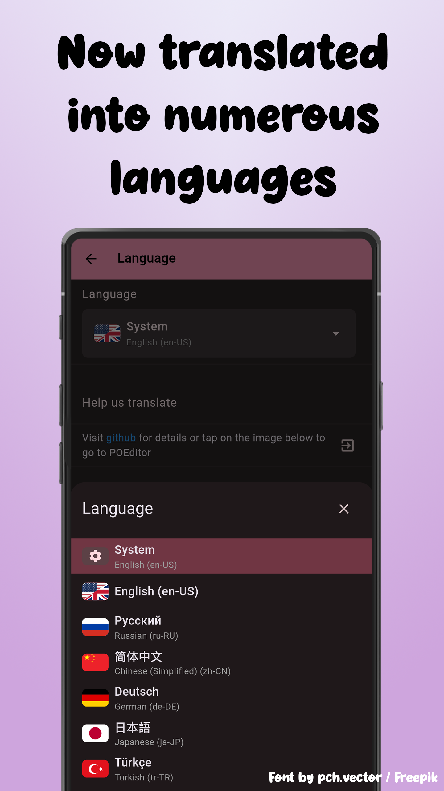

  
  <h1>LoliSnatcher</h1>
  
<em>Client for booru imageboards. View images and videos, do batch downloads from many booru sites with extensive customization</em>

  
  
  
  
  

## Screenshots

<table>
  <tr>
    <td></td>
    <td></td>
    <td></td>
    <td></td>
  </tr>
  <tr>
    <td></td>
    <td></td>
    <td></td>
    <td></td>
  </tr>
</table>

## Features

- **Massive list of supported Booru engines** - Browse content from Danbooru, Gelbooru, e621, and many more
- **Extensive Tabs system** - Run multiple searches simultaneously with independent tab sessions, each with their own booru, tags, and scroll position. Search all your tabs using Tabs manager with detailed filters.
- **Customization** - Deep settings for UI and behavior: themes, interface, layouts, image scaling, and much more
- **Batch download** - Download multiple images/videos at once with customizable settings
- **Sync** - Sync favourites and settings across multiple devices
- **Tag management** - Favourites, filters, blacklists, and tag history
- **Privacy-First** - No data collection, all data stored locally
- **Material 3** - Modern theming with dynamic colors and dark mode

<strong>Supported Booru Platforms</strong>

- Danbooru

- Gelbooru

- GelbooruV1 (Booru.org)

- Moebooru

- Philomena

- Shimmie

- e621

- Szurubooru

- Hydrus Network

- Sankaku (Default and Idol)

- rule34.xyz / rule34.world

- rule34hentai

- Booru On Rails (Twibooru)

- InkBunny

- AGNPH

- FurAffinity

- Realbooru

- RainBooru

- r34world/xyz

- And more...

## Install

### Android

## Building from Source

See [BUILDING.md](.github/BUILDING.md) for instructions.

## Contributing

Contributions are welcome! Please read our [Contributing Guidelines](CONTRIBUTING.md) before submitting a pull request.

We especially welcome:
- Bug fixes
- New booru platform support
- Translations (see [localization guide](CONTRIBUTING.md#localization--translations))
- Documentation improvements

## Translation

We are working on translating the app to other languages using [POEditor](https://poeditor.com/join/project/RgscnzeWts), please get in touch there or in our Discord server if you are interested in helping us.

## Links

- [Discord Server](https://discord.gg/yD47ANdEXW) - Community and support
- [Privacy Policy](privacypolicy.md)
- [Report Issues](https://github.com/NO-ob/LoliSnatcher_Droid/issues)

## Credits

- **App Icon** - [Showers-U](https://www.pixiv.net/en/users/28366691) on Pixiv
- Built with [Flutter](https://flutter.dev/)

## License

This project is licensed under the **GNU Affero General Public License v3.0** - see the [LICENSE](LICENSE) file for details.

